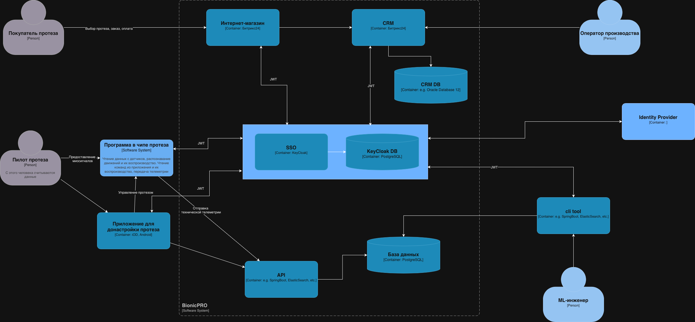
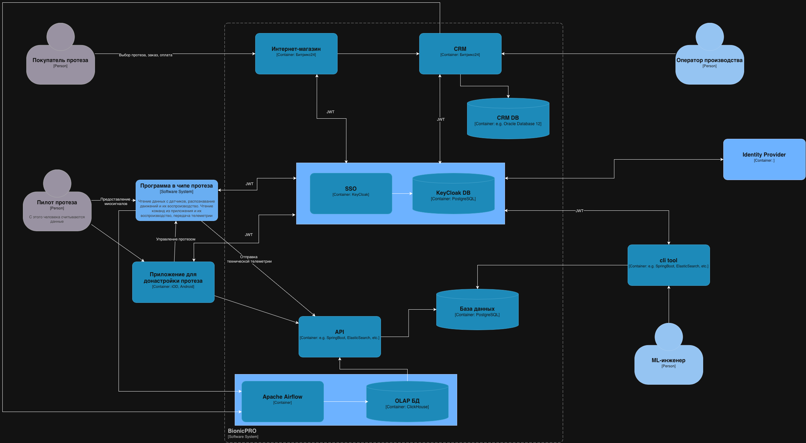

Для запуска проекта выполните команду

```bash
docker-compose up -d
```

Пользовательский интерфейс будет доступен [тут](http://localhost:3000). Для теста можно использовать:

```
login: user1
password: password123
```

Если видите ошибку получения отчета, то необходимо подождать. Отчеты формируются автоматически один раз в день.

# Задание 1. Повышение безопасности системы

## 1. Предложите архитектурное решение и доработайте диаграмму C4 для управления учётными данными пользователя



# Задание 2. Разработка сервиса отчётов

## 1. Создать архитектуру решения для подготовки и получения отчётов


